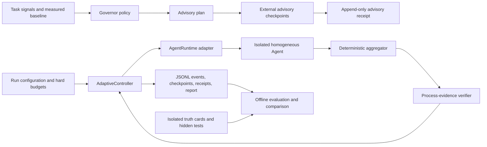

# Architecture and trust boundaries

Multi-Agent Governor is a small policy and execution package, not a general
Agent framework. Its architecture separates advisory planning, controlled
execution, and truth-based evaluation so that a runtime decision cannot depend
on a hidden answer.

## Component map

The policy is used in two different contexts:

- `GovernorSession.plan()` and `magov plan` return advice without owning Agent
  execution.
- `magov advisory` records and replays externally executed Agent checkpoints,
  but does not claim runtime enforcement.
- `AdaptiveController.execute()` and `magov run` own admission of every
  additional Agent, apply hard budgets, and record why execution continued or
  stopped.

Only the second path can claim that Governor enforced an Agent limit.

## Runtime path

The executable loop is deliberately baseline-first:

1. `magov run` parses one explicit policy version, task, runtime, verifier, and
   budget.
2. `AdaptiveController` launches exactly one baseline request through an
   `AgentRuntime`.
3. `JsonFindingsAggregator` combines structured results without calling a
   model.
4. `ReviewEvidenceVerifier` measures changed-file coverage, independent
   review, conflicts, and remaining process risks. It does not read truth.
5. The controller records a checkpoint and asks the policy whether one more
   Agent has enough observable marginal value.
6. The loop stops at a target, an observed plateau, a hard resource boundary,
   a user Agent cap, or a runtime failure.

`pilot-v2` treats the initial plan as a forecast rather than an execution cap.
The user-provided `max_agents` remains an absolute safety limit. Reaching it
with unresolved process requirements produces `cap_reached_incomplete`.

## Package layout

| Path | Responsibility |
| --- | --- |
| `models.py` | Validated task signals, observations, budgets, plans, and decisions |
| `policy.py` | Planning and checkpoint-time scaling rules |
| `advisory.py` | Append-only externally executed session receipts and deterministic replay |
| `execution.py` | Adaptive controller, deterministic aggregation, and review verification |
| `runtime.py` | Runtime, aggregation, and verification protocols |
| `adapters/codex_cli.py` | Isolated Codex process adapter and usage extraction |
| `events.py` | Append-only JSONL event writing and replay loading |
| `evidence.py` | Explainable decision receipts |
| `evaluation.py` | Task materialization, leakage checks, scoring, and summaries |
| `adaptive_evaluation.py` | Truth-free adaptive arm construction and post-run outcomes |
| `fixed_execution.py` | Exact-count reference-arm execution |
| `telemetry.py` | Local execution-report summarization |
| `cli.py` / `eval_cli.py` | Runtime and evaluation command surfaces |

The `scripted` adapter is deterministic test infrastructure. Its reports are
always marked `real_experiment: false`; it cannot be presented as a real model
result.

## Trust boundaries

| Boundary | Allowed data | Forbidden data |
| --- | --- | --- |
| Agent workspace | Project code, public tests, review instructions, ordinary project files | Truth cards, hidden tests, provenance, prior traces, Git history that reveals a fix |
| Runtime artifacts | Agent JSONL, stderr, final messages, controller events | Files mounted back into an Agent workspace |
| Controller verifier | Structured findings, coverage, conflicts, actual usage | Hidden truth, historical fix metadata, post-run score |
| Offline scorer | Completed outcomes, isolated truth, hidden tests, adjudications | Inputs that can change a completed Agent run |
| Public result | Deterministic metrics and documented limitations | Credentials, private source, raw sensitive traces |

Materialization removes `.git`, rejects escaping symlinks, and scans for truth
or provenance leakage before an Agent starts. Runtime artifacts must resolve
outside the Agent workspace. Truth is unlocked only after all preregistered
arms for a task have completed.

## Accounting invariants

- `actual_total_agents` counts every Governor-owned model process.
- Native Codex multi-Agent execution is disabled inside those processes.
- Cached input is a subset of input and is not added again to total tokens.
- Reasoning output is diagnostic and is not added again to output tokens.
- A hard budget is checked after an Agent returns; an unknown in-flight cost
  may cross the threshold, but no later Agent is admitted.
- A fixed-count arm must reach its declared count unless a recorded fault,
  timeout, or safety ceiling invalidates the trial.
- Deterministic aggregation is used for the registered review evaluation; no
  hidden model judge is inserted during merging or scoring.

## Extension points

New runtimes implement `AgentRuntime`. New aggregation or process verification
strategies implement the protocols in `runtime.py`. Extensions must preserve:

- baseline-first admission;
- one auditable checkpoint per completed Agent;
- truth-free runtime inputs;
- explicit resource and Agent caps;
- distinguishable complete, incomplete, censored, and failed stops;
- event and usage records sufficient for deterministic replay.

Adding a new task type requires a verifier whose observable process contract
can be checked without model self-confidence. If such a verifier does not
exist, the executable Governor path should not claim reliable completion for
that task type.

## Evaluation boundary

The evaluation package is intentionally adjacent to, but not inside, the
runtime decision loop. Public historical tasks test reconstruction, isolation,
accounting, and descriptive behavior. They do not form an unseen benchmark.
Effectiveness claims require separately held-out tasks and the success
criteria in [`product-goal.md`](product-goal.md).
